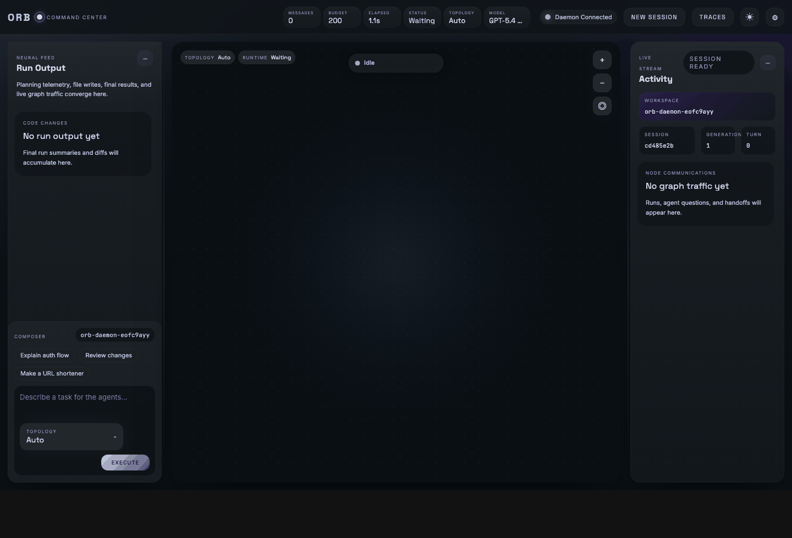

# Orb

A network of LLM agents that collaborate to solve tasks. Agents communicate via async channels over a shared message bus, pick models dynamically based on task complexity, and build up a persistent knowledge graph across runs.


---

## Install

```bash
conda create -n orb python=3.12 -y && conda activate orb
pip install -e .
orb onboard   # first-time auth + settings
```

Set `ANTHROPIC_API_KEY` / `OPENAI_API_KEY` env vars, or run `orb auth anthropic` / `orb auth openai` to configure interactively.
OpenAI/Codex cloud models currently exposed by Orb are `gpt-5.4-nano`, `gpt-5.4-mini`, and `gpt-5.4`.

Provider enablement and defaults live in `~/.orb/config.json`.

---

## Usage

```bash
orb daemon start                        # start background daemon
orb tui                                 # attach terminal UI
orb dashboard                           # open web dashboard at localhost:8080
orb daemon stop
```

The daemon also supports provider filtering and remote binding:

```bash
orb daemon start --host 0.0.0.0
orb daemon restart --local-only         # only local providers such as Ollama
orb daemon restart --cloud-only         # only cloud providers
```

---

## Topologies

Orb automatically selects the agent topology based on task complexity. Topologies range from a lightweight triad (coordinator, coder, reviewer) to a full hierarchy with a dedicated researcher and multiple reviewers.

**Triad** — general coding tasks


**Dual Review** — high-correctness tasks


**Hierarchy** — complex planning + implementation


**Custom topologies**

```bash
orb topologies init   # copy sample to ~/.orb/topologies.yaml
```

Edit `~/.orb/topologies.yaml` to define your own agent graphs. The dashboard hot-reloads on save.

---

## GraphRAG Memory

Agents extract and persist structured facts across runs. Each topology gets its own knowledge store at `~/.orb/chroma/<topology_id>/<cluster>`.

```yaml
persist_base: "~/.orb/chroma"

clusters:
  implementation:
    agents: [coordinator, coder]
  review:
    agents: [reviewer, tester]
```

Browse stored facts:

```bash
chroma run --path ~/.orb/chroma --port 8001
npx chromadb-admin   # open http://localhost:3000
```

---

## Model Tiers

| Tier | Models |
|------|--------|
| Local | Ollama — Qwen, Llama, DeepSeek |
| Cloud lite | Claude Haiku, GPT-5.4 Nano |
| Cloud fast | Claude Sonnet, GPT-5.4 Mini |
| Cloud strong | Claude Opus, GPT-5.4 |

```bash
orb --local-only "hello world"
orb --cloud-only "complex refactor"
orb --model gpt-5.4-mini "build a CLI"
orb --model claude-opus-4-6 "..."
```

---

## Common Flags

| Flag | Description |
|------|-------------|
| `--budget N` | Max message count (default: 200) |
| `--local-only` | Force Ollama |
| `--cloud-only` | Force cloud models |
| `--model MODEL` | Pin model for all agents |

---

## Testing

```bash
pytest tests/ -v
pytest -m scale                        # opt-in scale/perf tests
ANTHROPIC_API_KEY=sk-ant-... pytest tests/integration/ -v
```

---

## Project Structure

```
orb/
├── agent/          # LLMAgent, tools, fact extraction, prompt building
├── cli/            # CLI, REPL, TUI, auth, config
├── llm/            # LLM clients (Anthropic, OpenAI, Ollama)
├── memory/         # GraphRAG — SubgraphStore, ChromaDB backend, BridgeAgent
├── messaging/      # MessageBus, AgentChannel, message types
├── orchestrator/   # Run lifecycle, completion tracking
├── topologies/     # YAML loader, schema, built-in topologies
└── runtime/        # GraphRuntime — wires everything together
web/
├── server.py       # aiohttp server + WebSocket
├── bridge.py       # Bus events → dashboard state
└── static/         # Dashboard UI (HTML/CSS/JS)
```

---

## License

GNU GPL v3.0 — Copyright (C) 2026 Souranil Sen.
