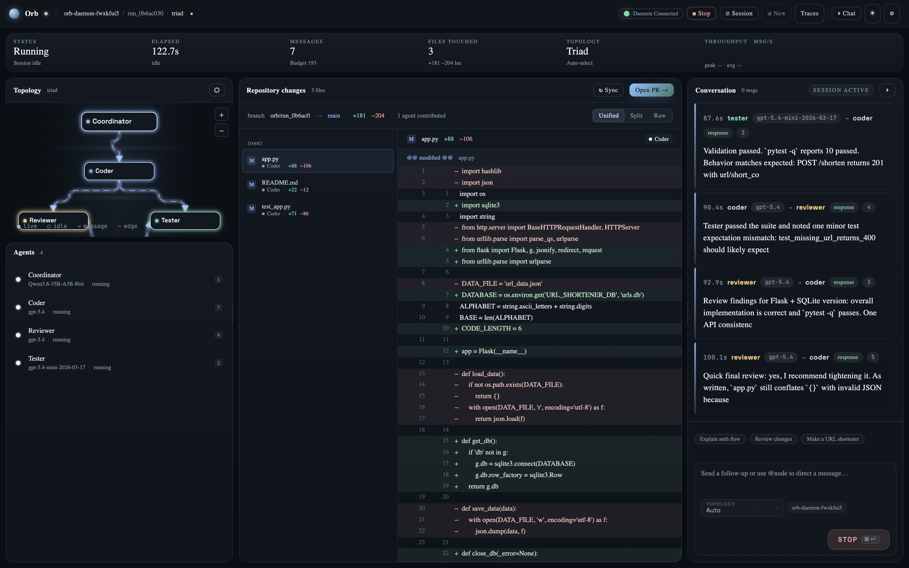
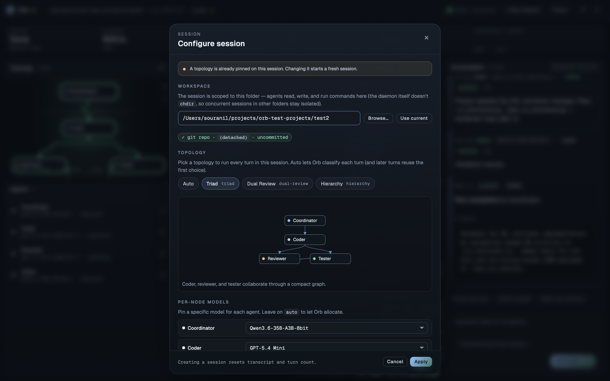
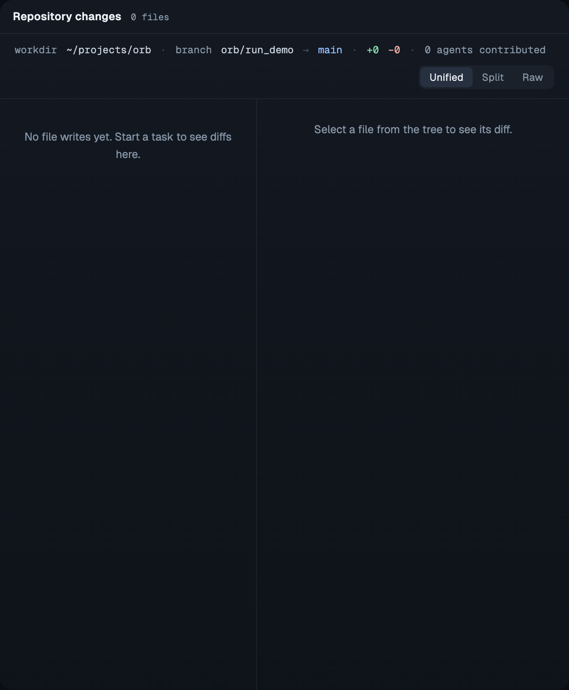
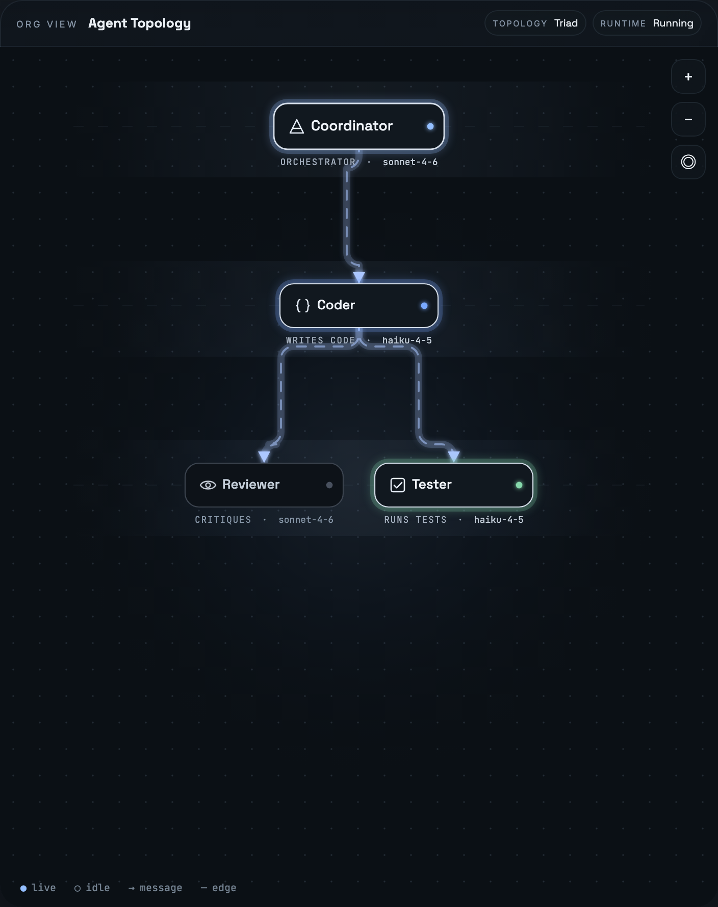
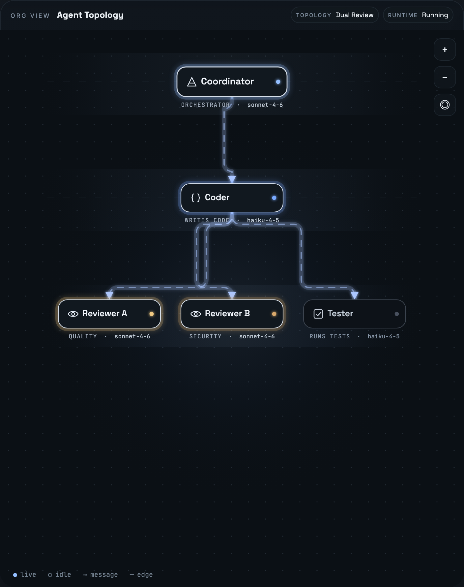
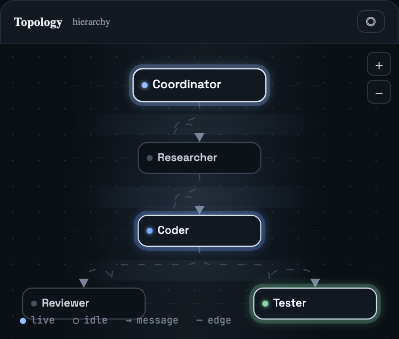
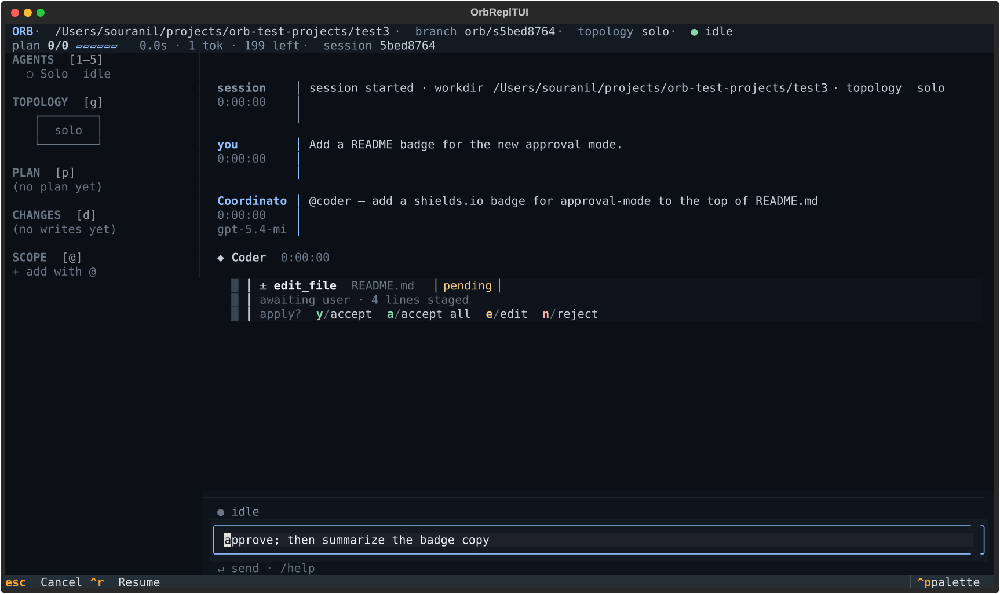

# Orb

Orb is a **multi-tenant** multi-agent coding runtime with a daemon, terminal UI, browser dashboard, persisted run traces, topology selection, per-node model allocation, and a Python SDK for harness integration.

It is built around a simple idea: treat coordination as a runtime problem, not just a prompt problem. Orb chooses a topology, classifies the task, assigns models per node, runs the graph, and records enough telemetry to inspect what happened afterward. A single daemon hosts N concurrent sessions — each with its own workdir, FSM, and dashboard state — so external harnesses (hermes, openclaw) can run parallel evals against one Orb instance.



The browser dashboard is a three-column workbench: a topology minimap and
agents list on the left, **Repository changes** (file tree + unified diff) as
the hero in the middle, and a conversation drawer on the right. The top
breadcrumbs show the full session workdir (tildified as `~/projects/repo`);
the hero toolbar repeats it alongside branch/diff stats; agents render as
compact pill chips with a role-colored status dot; a summary strip tracks
status, elapsed, messages, files touched, topology, and a live throughput
sparkline.

### Workflow

1. Open the dashboard (`orb dashboard`). The **Session** modal auto-opens on first load so you can pick a workdir before anything else happens.
2. Browse to a folder with the built-in file picker or paste an absolute path. Orb auto-detects whether it's a git repo and offers to run `git init` inline if it isn't.
3. Pick a topology (with inline SVG preview) and optionally pin a model per node — or leave everything on Auto.
4. Type a task in the composer and press **Send** (⌘↵).
5. The topology panel lights up as nodes start working; file writes stream into the Repository changes panel with per-author attribution; the Conversation drawer streams agent-to-agent messages live.
6. When planning completes, Orb pins the topology + per-node model map onto the session — follow-up turns reuse that allocation instead of re-classifying.
7. To return to a prior session after a daemon restart (or just to continue an older run), click **Resume** in the chrome — the modal lists every known session with workdir, topology, and last-touched timestamp; clicking one reattaches the dashboard.

### Session config



The Session modal is the one place to set **workspace**, **topology**, and
**per-node model** pins before a run. Each session is scoped to its own
workdir — the sandbox is rooted there and every filesystem tool call resolves
against it. No `os.chdir` in the daemon process, so concurrent sessions in
different workdirs stay isolated. Agents see the absolute workdir in their
system prompt (`## Working directory`), so "review the code" doesn't have to
guess where the repo lives. Topology and model pins carry through to the
first run and then stay locked for the rest of the session.

### Repository changes



Every file write the crew performs lands in the middle panel. The file tree
groups by folder, shows each file's +/− line counts, and attributes the
change to the agent that made it. Clicking a file renders a unified diff
with per-hunk author chips.

### Topologies

| Solo | Triad | Dual Review | Hierarchy |
|---|---|---|---|
| (single agent) |  |  |  |
| One agent end-to-end — pick for trivial / one-off tasks | Coordinator → Coder → Reviewer & Tester | Coordinator → Coder fans out to Reviewer A, Reviewer B, and Tester | Coordinator → Researcher → Coder → Reviewer & Tester |

### TUI



The TUI streams LLM responses **token-by-token** into the active turn — no waiting for the full message at completion. Multi-agent topologies (e.g. `triad`) keep each agent's stream in its own lane.

**Pre-write approval.** By default, agent file writes pause for explicit user approval — the TUI prompts with `y` (accept), `a` (accept all), `e` (edit), `n` (reject). Pass `--no-review` to `orb tui` to let agents write directly, or set `approval_required: false` when creating a session via the API.

**Slash commands.** Type `/help` in the TUI for the full list. The picker on launch covers topology selection (no `--topology` flag needed); `/topology` mid-session is honored when the topology isn't already locked.

## What Orb Does

- Runs coding tasks through explicit topologies (`solo`, `triad`, `dual-review`, `hierarchy`) — picks the smallest one the task actually needs
- Hosts **N concurrent sessions on one daemon** — each with its own workdir, FSM, sandbox, and dashboard state (Option B multi-tenancy for harness integration)
- Classifies tasks before execution and records the chosen topology, routing reason, and classifier model
- Assigns models per node instead of forcing one model across the whole run
- Exposes a live TUI and dashboard backed by the same daemon, plus a **Python SDK** (`orb.client.OrbClient`) for programmatic control
- Exposes a versioned `/api/v1/*` HTTP + WebSocket API with a `{ok, code, data}` envelope and session-scoped routes
- Drives run lifecycle through an explicit **state machine** (`idle → planning → running → completed | errored | stopping`) with broadcasts for every transition
- Streams incremental dashboard activity as nodes work, including node-local activity cards, message flow, and payload/context details for `send_message` events
- **Auto-restores sessions from disk** on daemon restart — a page refresh or URL share transparently resurrects the session
- **Resume** any prior session from the dashboard header or `Ctrl+R` in the TUI; stale in-flight markers from a crashed daemon are sanitized on restore so the UI never shows phantom "running" state
- Persists session-aware traces for replay, inspection, and future routing work
- Supports local and cloud providers, including `vmlx`, `omlx`, `openai-codex`, `ollama`, and `anthropic`
- Stores GraphRAG memory in Chroma-backed topology/cluster stores

## Current Defaults

Out of the box, Orb currently defaults to:

- `vmlx`: enabled
- `openai-codex`: enabled
- `ollama`: disabled
- `omlx`: disabled
- `anthropic`: disabled

This default mix gives Orb one local provider path and one cloud provider path without requiring all providers to be configured.

Provider settings live in `~/.orb/config.json`.

Orb now expects provider and model selection to come from config and provider catalog data. Runtime paths should not hardcode model IDs or inline fallback defaults.

## Install

Prerequisites:

- Python `3.11+`
- `git`
- one or more reachable model providers
- optional: Conda if you want an isolated env the same way the repo examples use

Clone and install Orb:

```bash
git clone <your-orb-repo-url>
cd orb
```

Create an environment and install the package:

```bash
conda create -n orb python=3.12 -y
conda activate orb
pip install -e .
orb onboard
```

For local development, install the test extras too:

```bash
pip install -e ".[dev]"
```

`orb onboard` helps with initial auth and common setup.

Depending on the providers you want to use:

- `vmlx` expects a local OpenAI-compatible endpoint, defaulting to `http://localhost:1234/v1`
- `omlx` expects a local OpenAI-compatible endpoint, defaulting to `http://localhost:8000/v1`
- `openai-codex` uses your OpenAI/Codex credentials
- `anthropic` uses your Anthropic credentials
- `ollama` expects a reachable Ollama server

You can also configure auth directly:

```bash
orb auth openai
orb auth anthropic
```

Typical first-run setups:

Use the current defaults, with local `vmlx` plus cloud `openai-codex`:

```bash
orb onboard
orb daemon start
orb tui
```

Use only local inference:

```bash
orb daemon start
orb tui --topology auto
```

Use only cloud inference:

```bash
orb auth openai
orb daemon start
orb tui --connect http://127.0.0.1:8080
```

## Basic Workflow

Start the daemon:

```bash
orb daemon start
```

Attach the TUI:

```bash
orb tui
```

Open the dashboard:

```bash
orb dashboard
```

Stop the daemon:

```bash
orb daemon stop
```

By default, the daemon binds to `http://127.0.0.1:1337`. For
dashboards on other machines or containers, bind to all interfaces:

```bash
orb daemon start --host 0.0.0.0 --port 1337
```

If you want a different port:

```bash
orb daemon start --host 0.0.0.0 --port 5000
orb tui --port 5000
orb dashboard --connect http://127.0.0.1:5000
```

You can also start work immediately from the client:

```bash
orb tui --port 5000 "fix the failing tests"
orb dashboard --connect http://127.0.0.1:5000 "review the current diff"
```

Scope a dashboard session to a specific folder — the session runtime is
anchored to that workdir without the daemon ever calling `os.chdir`, so
concurrent sessions in other folders stay isolated:

```bash
orb dashboard --workdir ~/projects/url-shortener
```

Pick a topology and pin a specific model per node for a fully-manual run:

```bash
orb dashboard \
  --topology triad \
  --agent-model coder=claude-opus-4-7 \
  --agent-model reviewer=claude-sonnet-4-6 \
  "add a rate limit to /shorten"
```

The dashboard also exposes the same three controls from the **⊘ Session**
button in the chrome — workspace path, topology pill list, and a model
`<select>` per agent.

## CLI Overview

```bash
orb --help
```

Current top-level commands:

- `orb auth`
- `orb logs`
- `orb config`
- `orb models`
- `orb onboard`
- `orb trace`
- `orb topologies`
- `orb tui`
- `orb dashboard`
- `orb daemon`
- `orb sessions` — list/show/rm/prune active and on-disk sessions

Useful global flags:

- `--model MODEL`: pin a model
- `--local-only`: restrict to local providers
- `--cloud-only`: restrict to cloud providers
- `--budget N`: set a global message budget
- `--timeout N`: set timeout in seconds
- `--connect URL`: attach TUI or dashboard to an existing daemon

## Topologies

Orb ships with four bundled topologies:

- `solo`: single agent, no coordinator — for trivial / throwaway tasks
- `triad`: coordinator, coder, reviewer, tester
- `dual-review`: stronger correctness/review shape
- `hierarchy`: broader planning and execution shape

You can request one explicitly:

```bash
orb tui --topology solo
orb tui --topology triad
orb tui --topology dual-review
orb tui --topology hierarchy
```

Or let Orb choose automatically:

```bash
orb tui --topology auto
```

Topologies are defined as explicit runtime graphs, not hardcoded branching scattered through the codebase.

## Task Classification and Routing

Before execution, Orb performs a topology-classification step.

That classification currently:

- chooses a task type
- selects a topology
- records a routing reason
- returns candidate topologies
- records which model performed the classification

The classifier is behind a dedicated runtime interface, so the current provider-backed lightweight classifier can later be replaced by a trained in-house routing model without changing the rest of the runtime orchestration.

In the UI you can now see:

- the classifier model used for routing
- the chosen topology
- the planned model for each agent card/node
- routing metadata in trace detail views

## Per-Node Model Allocation

After topology selection, Orb assigns models per node rather than using one model for the whole graph.

This allocation considers:

- provider availability
- enabled/disabled models from config
- task and node complexity
- node role/category
- explicit model pins

The dashboard surfaces those planned assignments before the run and the active model IDs as the run progresses.

## Live Dashboard Behavior

The dashboard is event-driven and is intended to show the run as it happens.

It currently:

- renders planning state as soon as topology and per-node model allocation are known
- lays out agents and edges in the topology minimap on the left, adapting panel height to the number of rows in the topology graph
- surfaces `file_write` events in the Repository Changes panel as a file tree + unified diff with per-author attribution
- streams agent-to-agent messages into the Conversation drawer with routing arrows, msg-type badges, and role-colored dots
- tracks stats (status, elapsed, messages, files touched, topology, throughput) in the top summary strip
- opens a compact agent detail overlay in the left column when you click an agent row — toggles off when clicked again
- supports draggable column resize handles on desktop and a fixed-bottom composer on mobile
- locks the topology + per-node model allocation on the session after the first run; subsequent messages reuse the same graph instead of re-classifying

The daemon writes more descriptive run and dashboard event logs to `~/.orb/run.log`.

## Providers and Model Selection

Orb supports five provider families:

- `vmlx` (local, OpenAI-compatible)
- `omlx` (local, OpenAI-compatible)
- `openai-codex` (cloud)
- `ollama` (local)
- `anthropic` (cloud)

All three local providers use a bounded, split httpx timeout
(`connect=10s`, `read=180s`) so a model that the server advertises
but hasn't actually loaded surfaces as a `ReadTimeout` in minutes,
not the 10-minute flat hang it used to be. When an LLM call does
fail, the agent's retry activity reports the specific exception
(e.g. `Retrying gemma-4-e4b-it-8bit (2/3) — ReadTimeout: …`) so
stalls are attributable instead of opaque.

Model catalogs can be inspected and refreshed through:

```bash
orb models
```

Provider selection and model defaults are controlled in `~/.orb/config.json`.

The runtime resolves provider/model choices from:

- configured `default_models`
- enabled catalog entries refreshed for each provider
- enabled configured models

If no valid configured model exists for a selected provider/tier, Orb should fail explicitly instead of silently choosing a hardcoded fallback model.

Examples:

```bash
orb --cloud-only "plan a refactor"
orb --local-only "summarize this module"
orb --model gpt-5.4-mini "build a CLI with tests"
```

## Dashboard and Trace Admin

The dashboard is not just a run viewer. It also exposes persisted run traces and session-aware history.

Orb records:

- topology choice
- task type
- routing mode and reason
- classifier model
- per-agent models
- stage timing
- token usage
- retries
- verifier and override events
- final outcome

Useful trace commands:

```bash
orb trace latest
orb trace latest --json
orb trace list --current-session
orb trace tail --current-session
orb trace show <run_id>
```

Trace files are stored per-session under the daemon anchor (never inside
your project repo):

```text
~/.orb/daemon/sessions/{session_id}/traces/{run_id}.json
```

## Custom Topologies

You can create or edit user-defined topology YAML:

```bash
orb topologies init
```

That copies a sample file to:

```text
~/.orb/topologies.yaml
```

Orb hot-reloads topology definitions in the dashboard/runtime flow.

## GraphRAG Memory

Orb persists structured memory into Chroma-backed stores organized by topology and cluster.

Example shape:

```yaml
persist_base: "~/.orb/chroma"

clusters:
  implementation:
    agents: [coordinator, coder]
  review:
    agents: [reviewer, tester]
```

Recent work also optimized ephemeral Chroma stores so short-lived runs use a lighter embedding path, reducing write/query latency in tests and local iteration.

To inspect local Chroma data:

```bash
chroma run --path ~/.orb/chroma --port 8001
npx chromadb-admin
```

## Repo Layout

```text
orb/
├── agent/          # agent runtime, tools, compaction, prompting
├── cli/            # CLI entrypoints, daemon management, auth, config, TUI
│   └── paths.py    # single source of truth for ~/.orb/ layout
├── llm/            # provider integrations (vmlx, omlx, ollama, openai-codex, anthropic)
├── memory/         # GraphRAG and Chroma-backed memory backends
├── messaging/      # message bus, channels, message types
├── orchestrator/   # orchestrator runtime
├── runtime/        # graph runtime, classifier, session and trace plumbing
├── topologies/     # bundled topology definitions (solo/triad/dual-review/hierarchy), schema, loader, factory
├── tracing/        # run trace schema and persistence helpers
web/
├── bridge.py       # runtime events -> dashboard state
├── server.py       # API, websocket, dashboard, trace admin endpoints
├── api_v1.py       # envelope-based /api/v1/* routes
└── static/         # browser UI
```

## Development

Run tests:

```bash
pytest -q
```

Useful targeted suites:

```bash
pytest -q tests/test_cli_main.py
pytest -q tests/test_server_api.py
pytest -q tests/test_run_trace.py
pytest -q tests/test_server_events.py
```

## Python SDK

Orb ships a typed async client for programmatic control — used by external
harnesses (hermes, openclaw) to drive parallel evals against one daemon:

```python
from orb.client import OrbClient

async with OrbClient("http://127.0.0.1:1337") as client:
    session = await client.create_session(
        workdir="/path/to/repo",
        topology="triad",
        agent_models={"coder": "claude-opus-4-7"},
    )
    await session.start_run("fix the failing tests")
    event = await session.wait_for_terminal()  # blocks until completed/errored
    print(event.run_state, event.final_result)
```

`OrbClient.stream_events(session_id)` yields every WebSocket event as a typed
`Event` dataclass; `Event.is_terminal` is true for `completed` and `errored`.

## Filesystem Layout

Orb anchors all of its own state under `~/.orb/` — your project workdir
is never polluted with bookkeeping files. The session's `workdir` is
strictly the sandbox root for agent file operations; Orb writes zero
bytes there.

```text
~/.orb/
├── config.json                  # provider + model config
├── run.log                      # shared daemon log
└── daemon/                      # fixed anchor (never /tmp)
    ├── daemon.json              # pid / host / port
    ├── registry.json            # session index (survives restarts)
    └── sessions/
        └── {session_id}/
            ├── snapshot.json    # ConversationSession (turns, carryover)
            ├── dashboard.json   # dashboard state
            └── traces/
                ├── {run_id}.json
                └── by-session/{session_id}.json
```

The daemon always anchors at `~/.orb/daemon/` regardless of the shell's
CWD — so registries, snapshots, and traces survive restarts and
reboot-wiped `/tmp`.

## Multi-Tenant Daemon

A single daemon registers N `GraphRuntime` instances keyed by session_id.
Broadcasts are multiplexed onto one WebSocket (`/api/v1/ws?session_id=X`);
every payload is tagged with its originating session so the dashboard can
filter per-client.

The registry at `~/.orb/daemon/registry.json` maps each session to its
workdir + snapshot path. On daemon restart, the dashboard's stale
`?session=...` URL transparently resurrects the session from disk; on
genuinely missing sessions the WS handler emits `SESSION_NOT_FOUND` and
the frontend drops the stale URL before reconnecting.

If a daemon died mid-run, the resurrected session's dashboard state is
**sanitized** on restore — any `run_state: running` or stuck agent
statuses from the crashed daemon are rewritten to `errored` / `idle` so
the UI doesn't show a phantom in-flight run.

Inspect and manage active sessions from the CLI:

```bash
orb sessions list
orb sessions show <prefix>
orb sessions rm <prefix>
orb sessions prune --older-than 7d
```

### Resuming a session

Every prior session that still has a snapshot on disk can be reattached:

- **Dashboard**: click **Resume** in the header; pick a session from the
  modal (workdir, topology, last updated).
- **TUI**: press **Ctrl+R** to open the chooser; press 1–9 to switch.
- **API**: `GET /api/v1/sessions?include=known` returns both in-memory
  and registry-only sessions.

Resume preserves conversation turns, agent carryover, and locked
topology/models. Running LLM calls are *not* replayed — agent tool
calls (bash, partial file writes) aren't idempotent, so resume lands
you in an `idle` session with full context, ready for a new turn.

## Status

Orb currently has:

- multi-tenant daemon hosting N concurrent sessions with per-session workdir isolation
- fixed daemon anchor at `~/.orb/daemon/` — session snapshots, traces, and registry never pollute your project repo
- daemon-backed TUI and dashboard (WS multiplexed by session_id)
- session resume surface in dashboard and TUI; auto-sanitization of stale in-flight markers after a crashed daemon
- Python SDK + `/api/v1/*` envelope-based HTTP API for harness integration
- persistent session registry with auto-restore after daemon restart
- explicit runtime state machine (`idle → planning → running → completed | errored | stopping`)
- persisted session-aware traces
- four bundled topologies (`solo`, `triad`, `dual-review`, `hierarchy`) with hot-reload and inline SVG preview
- provider-backed topology classification with complexity-aware routing (solo for trivial tasks, up through hierarchy for larger work)
- per-node model allocation
- five supported providers (`vmlx`, `omlx`, `openai-codex`, `ollama`, `anthropic`) with bounded timeouts and user-visible retry reasons
- configurable provider catalogs/defaults
- dashboard visibility into routing and model choices

The next major layer is execution control: budget enforcement, timeout/fan-out policy, and controller-driven early stop/escalation.

## License

GNU GPL v3.0. Copyright (C) 2026 Souranil Sen.
