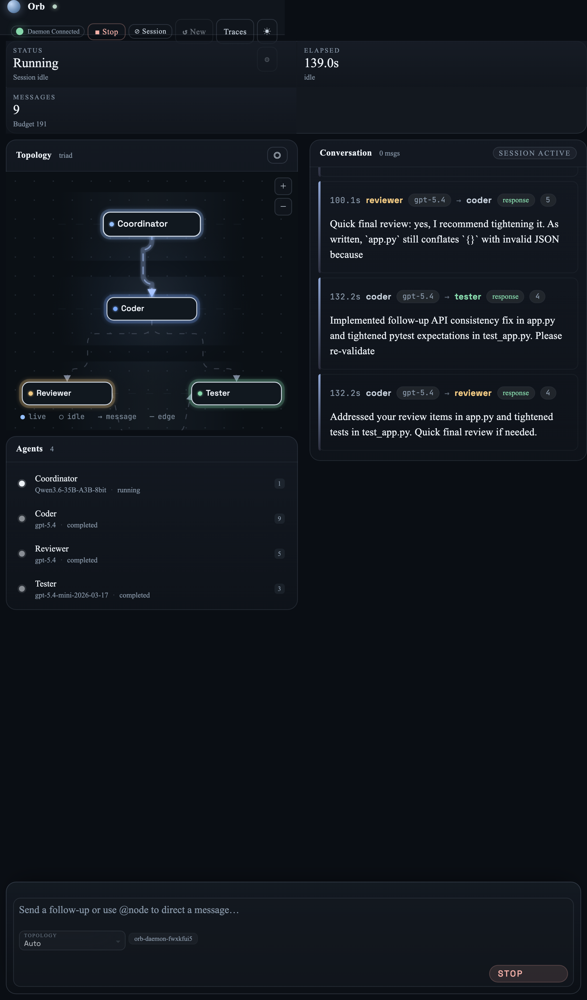

# Orb

Orb is a multi-agent coding runtime with a daemon, terminal UI, browser dashboard, persisted run traces, topology selection, and per-node model allocation.

It is built around a simple idea: treat coordination as a runtime problem, not just a prompt problem. Orb chooses a topology, classifies the task, assigns models per node, runs the graph, and records enough telemetry to inspect what happened afterward.


The browser dashboard is a three-column workbench: a topology minimap and
agents list on the left, **Repository changes** (file tree + unified diff) as
the hero in the middle, and a conversation drawer on the right. Agents render
as compact pill chips with a role-colored status dot; a summary strip across
the top tracks status, elapsed, messages, files touched, topology, and a
live throughput sparkline.

### Workflow

1. Open the dashboard (`orb dashboard`) and optionally scope it to a repo: `orb dashboard --workdir /path/to/repo`.
2. Click **⊘ Session** to configure the workspace, pick a topology, and pin models per node — or leave everything on Auto and type a task.
3. Type a task in the composer and press **Send** (⌘↵).
4. The topology panel lights up as nodes start working; file writes stream into the Repository changes panel with per-author attribution; the Conversation drawer streams agent-to-agent messages live.
5. When planning completes, Orb pins the topology + per-node model map onto the session — follow-up turns reuse that allocation instead of re-classifying.

### Session config


The Session modal is the one place to set **workspace**, **topology**, and
**per-node model** pins before a run. Workspaces are validated and the daemon
`chdir`s into them; topology and model pins carry through to the first
`/api/start` call and then stay locked for the rest of the session.

### Repository changes


Every file write the crew performs lands in the middle panel. The file tree
groups by folder, shows each file's +/− line counts, and attributes the
change to the agent that made it. Clicking a file renders a unified diff
with per-hunk author chips.

### Topologies

| Triad | Dual Review | Hierarchy |
|---|---|---|
|  |  |  |
| Coordinator → Coder → Reviewer & Tester | Coordinator → Coder fans out to Reviewer A, Reviewer B, and Tester | Coordinator → Researcher → Coder → Reviewer & Tester |

### Mobile



The dashboard stacks into a single column under 720 CSS px — topology first,
agents list, repository changes, then conversation — with the composer pinned
to the bottom of the viewport so it's always reachable on a phone.

### TUI


## What Orb Does

- Runs coding tasks through explicit topologies such as `triad`, `dual-review`, and `hierarchy`
- Classifies tasks before execution and records the chosen topology, routing reason, and classifier model
- Assigns models per node instead of forcing one model across the whole run
- Exposes a live TUI and dashboard backed by the same daemon
- Streams incremental dashboard activity as nodes work, including node-local activity cards, message flow, and payload/context details for `send_message` events
- Persists session-aware traces for replay, inspection, and future routing work
- Supports local and cloud providers, including `vmlx`, `openai-codex`, `ollama`, and `anthropic`
- Stores GraphRAG memory in Chroma-backed topology/cluster stores

## Current Defaults

Out of the box, Orb currently defaults to:

- `vmlx`: enabled
- `openai-codex`: enabled
- `ollama`: disabled
- `anthropic`: disabled

This default mix gives Orb one local provider path and one cloud provider path without requiring all providers to be configured.

Provider settings live in `~/.orb/config.json`.

Orb now expects provider and model selection to come from config and provider catalog data. Runtime paths should not hardcode model IDs or inline fallback defaults.

## Install

Prerequisites:

- Python `3.11+`
- `git`
- one or more reachable model providers
- optional: Conda if you want an isolated env the same way the repo examples use

Clone and install Orb:

```bash
git clone <your-orb-repo-url>
cd orb
```

Create an environment and install the package:

```bash
conda create -n orb python=3.12 -y
conda activate orb
pip install -e .
orb onboard
```

For local development, install the test extras too:

```bash
pip install -e ".[dev]"
```

`orb onboard` helps with initial auth and common setup.

Depending on the providers you want to use:

- `vmlx` expects a local OpenAI-compatible endpoint, defaulting to `http://localhost:1234/v1`
- `openai-codex` uses your OpenAI/Codex credentials
- `anthropic` uses your Anthropic credentials
- `ollama` expects a reachable Ollama server

You can also configure auth directly:

```bash
orb auth openai
orb auth anthropic
```

Typical first-run setups:

Use the current defaults, with local `vmlx` plus cloud `openai-codex`:

```bash
orb onboard
orb daemon start
orb tui
```

Use only local inference:

```bash
orb daemon start
orb tui --topology auto
```

Use only cloud inference:

```bash
orb auth openai
orb daemon start
orb tui --connect http://127.0.0.1:8080
```

## Basic Workflow

Start the daemon:

```bash
orb daemon start
```

Attach the TUI:

```bash
orb tui
```

Open the dashboard:

```bash
orb dashboard
```

Stop the daemon:

```bash
orb daemon stop
```

By default, run the daemon on `http://0.0.0.0:8080`.

Recommended startup:

```bash
orb daemon start --host 0.0.0.0 --port 8080
```

If you want a different port:

```bash
orb daemon start --host 0.0.0.0 --port 5000
orb tui --port 5000
orb dashboard --connect http://127.0.0.1:5000
```

You can also start work immediately from the client:

```bash
orb tui --port 5000 "fix the failing tests"
orb dashboard --connect http://127.0.0.1:5000 "review the current diff"
```

Scope a dashboard session to a specific folder (the daemon `chdir`s into it
for the whole session):

```bash
orb dashboard --workdir ~/projects/url-shortener
```

Pick a topology and pin a specific model per node for a fully-manual run:

```bash
orb dashboard \
  --topology triad \
  --agent-model coder=claude-opus-4-7 \
  --agent-model reviewer=claude-sonnet-4-6 \
  "add a rate limit to /shorten"
```

The dashboard also exposes the same three controls from the **⊘ Session**
button in the chrome — workspace path, topology pill list, and a model
`<select>` per agent.

## CLI Overview

```bash
orb --help
```

Current top-level commands:

- `orb auth`
- `orb logs`
- `orb config`
- `orb models`
- `orb onboard`
- `orb trace`
- `orb topologies`
- `orb tui`
- `orb dashboard`
- `orb daemon`

Useful global flags:

- `--model MODEL`: pin a model
- `--local-only`: restrict to local providers
- `--cloud-only`: restrict to cloud providers
- `--budget N`: set a global message budget
- `--timeout N`: set timeout in seconds
- `--connect URL`: attach TUI or dashboard to an existing daemon

## Topologies

Orb ships with three bundled topologies:

- `triad`: coordinator, coder, reviewer, tester
- `dual-review`: stronger correctness/review shape
- `hierarchy`: broader planning and execution shape

You can request one explicitly:

```bash
orb tui --topology triad
orb tui --topology dual-review
orb tui --topology hierarchy
```

Or let Orb choose automatically:

```bash
orb tui --topology auto
```

Topologies are defined as explicit runtime graphs, not hardcoded branching scattered through the codebase.

## Task Classification and Routing

Before execution, Orb performs a topology-classification step.

That classification currently:

- chooses a task type
- selects a topology
- records a routing reason
- returns candidate topologies
- records which model performed the classification

The classifier is behind a dedicated runtime interface, so the current provider-backed lightweight classifier can later be replaced by a trained in-house routing model without changing the rest of the runtime orchestration.

In the UI you can now see:

- the classifier model used for routing
- the chosen topology
- the planned model for each agent card/node
- routing metadata in trace detail views

## Per-Node Model Allocation

After topology selection, Orb assigns models per node rather than using one model for the whole graph.

This allocation considers:

- provider availability
- enabled/disabled models from config
- task and node complexity
- node role/category
- explicit model pins

The dashboard surfaces those planned assignments before the run and the active model IDs as the run progresses.

## Live Dashboard Behavior

The dashboard is event-driven and is intended to show the run as it happens.

It currently:

- renders planning state as soon as topology and per-node model allocation are known
- lays out agents and edges in the topology minimap on the left, adapting panel height to the number of rows in the topology graph
- surfaces `file_write` events in the Repository Changes panel as a file tree + unified diff with per-author attribution
- streams agent-to-agent messages into the Conversation drawer with routing arrows, msg-type badges, and role-colored dots
- tracks stats (status, elapsed, messages, files touched, topology, throughput) in the top summary strip
- opens a compact agent detail overlay in the left column when you click an agent row — toggles off when clicked again
- supports draggable column resize handles on desktop and a fixed-bottom composer on mobile
- locks the topology + per-node model allocation on the session after the first run; subsequent messages reuse the same graph instead of re-classifying

The daemon writes more descriptive run and dashboard event logs to `~/.orb/run.log`.

## Providers and Model Selection

Orb supports four provider families:

- `vmlx`
- `openai-codex`
- `ollama`
- `anthropic`

Model catalogs can be inspected and refreshed through:

```bash
orb models
```

Provider selection and model defaults are controlled in `~/.orb/config.json`.

The runtime resolves provider/model choices from:

- configured `default_models`
- enabled catalog entries refreshed for each provider
- enabled configured models

If no valid configured model exists for a selected provider/tier, Orb should fail explicitly instead of silently choosing a hardcoded fallback model.

Examples:

```bash
orb --cloud-only "plan a refactor"
orb --local-only "summarize this module"
orb --model gpt-5.4-mini "build a CLI with tests"
```

## Dashboard and Trace Admin

The dashboard is not just a run viewer. It also exposes persisted run traces and session-aware history.

Orb records:

- topology choice
- task type
- routing mode and reason
- classifier model
- per-agent models
- stage timing
- token usage
- retries
- verifier and override events
- final outcome

Useful trace commands:

```bash
orb trace latest
orb trace latest --json
orb trace list --current-session
orb trace tail --current-session
orb trace show <run_id>
```

Trace files are stored under:

```text
.orb/traces/
```

## Custom Topologies

You can create or edit user-defined topology YAML:

```bash
orb topologies init
```

That copies a sample file to:

```text
~/.orb/topologies.yaml
```

Orb hot-reloads topology definitions in the dashboard/runtime flow.

## GraphRAG Memory

Orb persists structured memory into Chroma-backed stores organized by topology and cluster.

Example shape:

```yaml
persist_base: "~/.orb/chroma"

clusters:
  implementation:
    agents: [coordinator, coder]
  review:
    agents: [reviewer, tester]
```

Recent work also optimized ephemeral Chroma stores so short-lived runs use a lighter embedding path, reducing write/query latency in tests and local iteration.

To inspect local Chroma data:

```bash
chroma run --path ~/.orb/chroma --port 8001
npx chromadb-admin
```

## Repo Layout

```text
orb/
├── agent/          # agent runtime, tools, compaction, prompting
├── cli/            # CLI entrypoints, daemon management, auth, config, TUI
├── llm/            # provider integrations and model typing
├── memory/         # GraphRAG and Chroma-backed memory backends
├── messaging/      # message bus, channels, message types
├── orchestrator/   # orchestrator runtime
├── runtime/        # graph runtime, classifier, session and trace plumbing
├── topologies/     # bundled topology definitions, schema, loader, factory
├── tracing/        # run trace schema and persistence helpers
web/
├── bridge.py       # runtime events -> dashboard state
├── server.py       # API, websocket, dashboard, trace admin endpoints
└── static/         # browser UI
```

## Development

Run tests:

```bash
pytest -q
```

Useful targeted suites:

```bash
pytest -q tests/test_cli_main.py
pytest -q tests/test_server_api.py
pytest -q tests/test_run_trace.py
pytest -q tests/test_server_events.py
```

## Status

Orb currently has:

- a daemon-backed TUI and dashboard
- persisted session-aware traces
- explicit topologies
- provider-backed topology classification
- per-node model allocation
- configurable provider catalogs/defaults
- dashboard visibility into routing and model choices

The next major layer is execution control: budget enforcement, timeout/fan-out policy, and controller-driven early stop/escalation.

## License

GNU GPL v3.0. Copyright (C) 2026 Souranil Sen.
